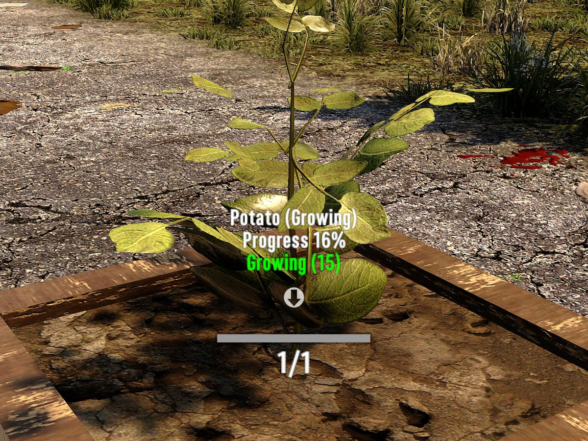

# OCB Plant Growing Info Mod - 7 Days to Die (V2.0) Addon

Reveal progress and light info when looking at growing plants.

In order to use this mod on a dedicated server, you need:
https://github.com/OCB7D2D/OcbRemoteDescription

[![GitHub CI Compile Status][3]][2]

## Download and Install

End-Users are encouraged to download my mods from [NexusMods][4].  
Every download there helps me to buy stuff for mod development.

Otherwise please use one of the [official releases][1] here.  
Only clone or download the repo if you know what you do!

## Changelog

### Version 0.4.0

- Update for 7D2D V2.0 (b295)

### Version 0.3.0

- First compatibility with V1.0 (exp)
- Verified compatibility with V1.0 (b333)

### Version 0.2.1

- Add check to avoid division by zero error

### Version 0.2.0

- Update compatibility for 7D2D A21.0(b313)

### Version 0.1.1

- Last A20.6/7 compatible version

## Compatibility

Developed initially for version a20.3(b3), updated through A21.0(b313).

[1]: https://github.com/OCB7D2D/OcbPlantGrowInfo/releases
[2]: https://github.com/OCB7D2D/OcbPlantGrowInfo/actions/workflows/ci.yml
[3]: https://github.com/OCB7D2D/OcbPlantGrowInfo/actions/workflows/ci.yml/badge.svg
[4]: https://www.nexusmods.com/7daystodie/mods/2166